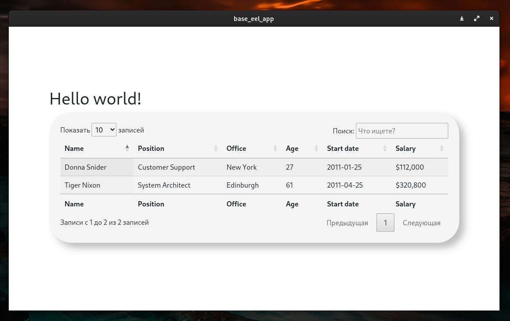

# Шаблон приложения на EEL
Шаблон кроссплатформенного web-view приложения на Python



## Установка
```
git clone https://github.com/nkeff/base_eel_app
```
Linux ->
```
python -m venv env && source ./env/bin/activate && pip install -r requirements.txt
```
Windows ->
```
python -m venv env
env/Scripts/activate.bat
python -m pip install -r requirements.txt
```
Скачать [отсюда](https://download-chromium.appspot.com/) версию chromium для своей платформы и распаковать ее в ./resourses/driver (путь до исполняемого файла должен быть ./resourses/driver/chrome)

## Запуск
```
python run.py
```

## Сборка в исполняемый файл
Настроить имя приложения можно в pyinstaller.py
```
python pyinstaller.py
```
Исполняемый файл с необходимыми ресурсами появится в папке **dist**

## Об этом репозитории
Создан для упрощения разработки настольных приложений на python с использованием библиотеки [eel](https://github.com/ChrisKnott/Eel)

Предустановлены JS библиотеки DataTables, Bootstrap5

## TODO
- [ ] Настроить запуск с любым установленным в системе браузером, при отсутствии браузера chromium в директории ./resourses/driver 
- [ ] При выборе в настройках mode=edge в операционной системе Windows запускаться во встроенном браузере (Edge)
- [ ] Замена chromium (более легковесное на аналогичном движке)
- [ ] Скриншоты из других операционных систем

